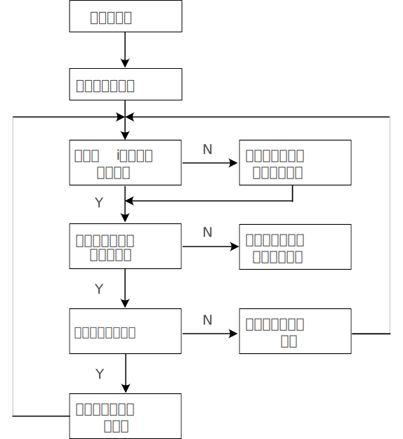
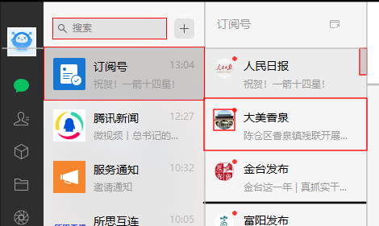

# 微信公众号RPA

### 1. 订阅号任务
逻辑流程如下：

1. 点击搜索框，输入 `dyh` 搜索
2. 点击搜索结果第一个元素 `订阅号`，显示订阅号列表
3. 判断订阅号第一个元素是否有小红点，如果有则点击该元素，执行步骤4.
4. 调用`阅读文章任务`，依次从顶部到底部点击订阅号页面的新闻和`复制链接`按钮
5. 判断下一个元素，直到列表的最后一个元素
6. 点击最后一个列表元素，然后再点击下一页滚动条，判断当前是否已经到滚动到列表底部。

### 2. 阅读文章任务
点击公众号对象后，右边会显示公众号新闻列表。其逻辑就是根据第一个新闻的位置，依次点击每个新闻，复制链接地址。目前的算法是，根据单位高度点击8个位置，计算结果。

### 3. 判断底部算法
判断底部有两个算法 `滚动条识别` 和 `公众号图标识别`

- 滚动条识别: 根据滚动条的颜色来识别是否到达底部；由于公众号元素是否选中，会导致滚动条的颜色发生改变【每个选中元素会覆盖一个透明灰色层】，因此每次计算需要点击最后一个元素，或者判断两种条件的滚动条色彩。
- 公众号图标识别: 截取底部公众号的图标，在点击滚动条之前和之后分别截取一个样本，即`icon_pre`和`icon_cur`, 如果两者相同说明到达屏幕底部。

### 4. 公众号名称识别
根据上述公众号图标识别算法，可以进一步改进，识别公众号的名称和是否已读。其逻辑过程如下：

1. 建立公众号图标的数据库: 将所有的公众号图标【25*25】截取，根据已读和未读保存成数据列表，并且标注对应的公众号名称，可以`人工标注`或者通过 `OCR 算法识别`
2. 每次遍历数据库，通过查询获取公众号的名称和已读状态；

> 注意：考虑数据库如果过大，每次判断的时间代价。如果关注公众号过多，建议先保存每个图标，最后统一通过接口计算每个 id 对应的公众号名称。

### 5. 系统特色

- 图标模糊匹配算法
- 点击随机等待时间
- 模拟人为点击逻辑
- 剪贴板智能跟踪
- 屏幕对象识别算法